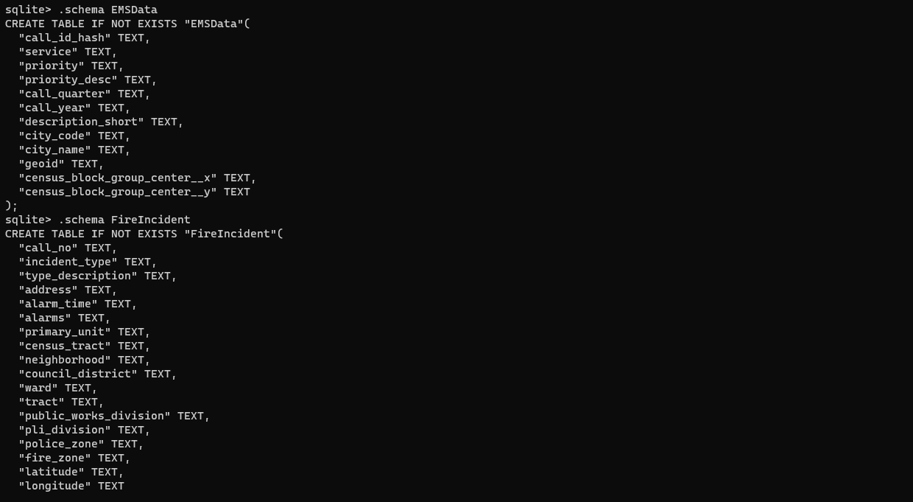

# ***CriticalJustice: Visualizing the Impact of Crime Prevention in Neighborhood Development***
 
<p align="center">
  
</p>

## Abstract

CriticalJustice visualizes factors in the determinants of crime and the relationship with infrastructure that affect neighborhood development. This research investigates the relationship of police dispatches to these community neighborhoods. This will be carried out specifically by speculating that increasing infrastructure investment has a disproportionate yield. In predominantly Black communities, there appears to be an excess need for neighborhood development. Ergo, the attention desperately needed for neighborhood investment slowly starts to shift towards crime prevention. However, factors of a community, such as lack of infrastructure and over-policing, relate to why there is a difference in a demand of need between primarily Black and white communities.

## Purpose

The purpose of this project is to shed light on the issues that are affecting predominatly Black communities in the city of Pittsburgh. With the use of SQLite3, the connections and correlations between the datasets will be able to be viewed. Also, with the use of queries, individuals will now be able to see how factors such as __Average Dispatches Per Shot Fired__, __Median Home Value__, and __Level of Need__, may contribute to the marginalization of a certain community in Pittsburgh, PA. These factors tend to be overlooked by individuals that live in the suburban communities of Pittsburgh, PA because they do not face these issues.

## Run Instructions in Terminal

SQLite3 command:

```SQL
sqlite3 community.db
```

To successfully run this command, the user would need to navigate to the `data` directory that contains each of the datasets. Once this command has been run, the program will switch to the SQLite3 command line shell.


After switching to the SQLite3 command line shell, the user can utilize the

```SQL
.tables
```

command to check that all tables are present within the SQLite3 database.


If the user wishes to view the factors that will be discussed of each dataset, the

```SQL
.schema
```

command to view the columns in each of the tables are present in the database.




Query Command:

```SQL
SELECT "column" FROM "database" WHERE "condition"
```

With this query command, users will be able to view the connections or correlations between the datasets. Also, the users will be able to view
how specific neighborhoods in Pittsburgh, PA differ based on some key factors such as __Average Dispatches Per Shot Fired__, __Median Home Value__, and __Level of Need__.

Map Visualization:

```python
python shotsMap.py
```

By running this command, a Folium map will be generated in the `index.html` file. The Folium map will contain an interactive world map, but the zoom will be focused on the city of Pittsburgh, Pennsylvania. In the city of Pittsburgh, there will be markers that represents __Shots Fired Data__ that is located in the `shots.csv` file.
