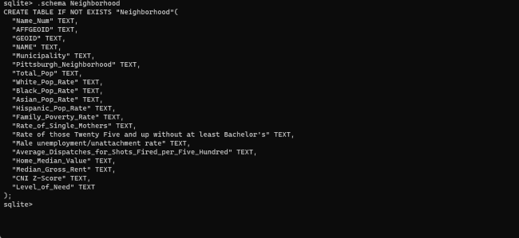
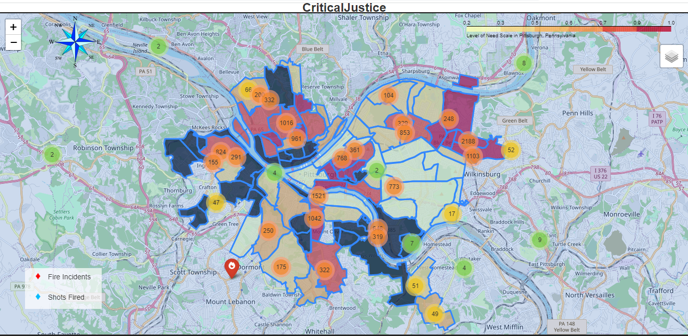

# ***CriticalJustice: Visualizing the Impact of Crime Prevention in Neighborhood Development***
 


## Abstract

**CriticalJustice** visualizes factors in the determinants of crime and the relationship with infrastructure that affect neighborhood development. This research investigates the relationship of police dispatches to these community neighborhoods. This will be carried out specifically by speculating that increasing infrastructure investment has a disproportionate yield. In predominantly Black communities, there appears to be an excess need for neighborhood development. Ergo, the attention desperately needed for neighborhood investment slowly starts to shift towards crime prevention. However, factors of a community, such as lack of infrastructure and over-policing, relate to why there is a difference in a demand of need between primarily Black and white communities.

## Purpose

The goal of this initiative is to increase public awareness of the problems with community development that Pittsburgh's predominantly Black neighborhoods are facing. SQLite3 may be used to visualize the connections and correlations between the downloaded datasets. Since they do not encounter these issues, people who live in Pittsburgh, Pennsylvania's suburbs, where there is a lower rate of crime and a smaller demand for services, occasionally ignore these factors. Additionally, individuals will be able to see how the use of queries can help them understand how elements like __Average Dispatches Per Shot Fired__, __Fire Incidents__, and __Level of Need__ may contribute to the marginalization of a specific community in Pittsburgh, PA, and a higher level of crime. Furthermore, the interactive map in **CriticalJustice** gives the argument a visual element by enabling people to see which communities have a greater need. Those who reside in suburban areas of Pittsburgh, Pennsylvania, where there is a lower rate of crime and a lesser need for services, sometimes disregard these variables because they do not experience these problems.

## Run Instructions in Terminal

### SQLite3 command:

```SQL
sqlite3 community.db
```

To successfully run this command, the user would need to navigate to the `src` directory that contains each of the datasets. Once this command has been run, the program will switch to the SQLite3 command line shell.


After switching to the SQLite3 command line shell, the user can utilize the

```SQL
.tables
```

command to check that all tables are present within the SQLite3 database.


If the user wishes to view the factors that will be discussed of each dataset, the

```SQL
.schema
```

command to view the columns in each of the tables are present in the database.




Query Command:

```SQL
SELECT "column" FROM "database" WHERE "condition"
```

Users will be able to see the relationships or correlations between the datasets with the help of this query command. Also, users will be able to see how distinct Pittsburgh, Pennsylvania neighborhoods vary depending on important variables including __Average Dispatches Per Shot Fired__, __Median Home Value__, and __Level of Need__.

# Map Visualization:

```python
python vector.py
```

A Folium map will be produced and placed in the file named `index.html` once this command has been performed. A zoomed-in, interactive map of Pittsburgh, Pennsylvania, will be included on the Folium map. There will be markers in the city of Pittsburgh that stand in for the **Shots Fired** data (found in the `shots.csv` file) and the **Fire Incident** data (placed in the `FireIncident.csv` file). As well as a compass rose to provide direction, the map includes a caption that describes which hue corresponds to the data point.


